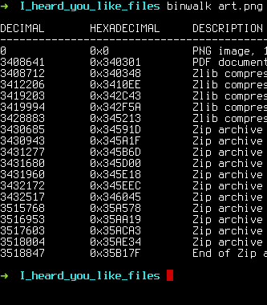

# I heard you like files

Le seul fichier est une image.png

## strings sur le ficher

Rien... une chaine est meme presente nous disant que le flag n'est pas ici

## transformation en pdf

Rien... Une chaine nous envoie balader est nous dis que c'est une fausse piste

## Binwalk

### Niveau 1

Quand on fait un binwalk on voit que plusieurs fichiers sont encodés apres le
"end of file" du png : 



On extrait tous les fichier avec

```bash
$ binwalk -e firmware.bin
```
### Niveau 2

Un fois extrait on observe plein de fichiers. La plupart sont inutiles.
Seulement le fichier word contien un fichier word/media/ qui contient une
image

Quand on fait un binwalk sur le fichier, encore une fois, plusieur fichier sont
encodes.


Un fichier retient particulierement mon attention "0x1636 JPEG image data"

Pour l'extraire il faut utiliser :

```bash
$ binwalk -D 'jpeg image:jpeg' image1png
```
### Niveau 3

On a maintenant 1636.jpeg

Etant donnee que le type du fichier etudie a change je recomence la procedure
standard (*file, cat, strings, binwalk*)

Avec **strings** on constate une chaine en base64 apres le "%%EOF"

j'essaye de le decoder :

```bash
echo "ZmxhZ3tQMGxZdEByX0QwX3kwdV9HM3RfSXRfTjB3P30K" | base64 -d
```

**BOOM** le flag :

flag{P0lYt@r_D0_y0u_G3t_It_N0w?}
