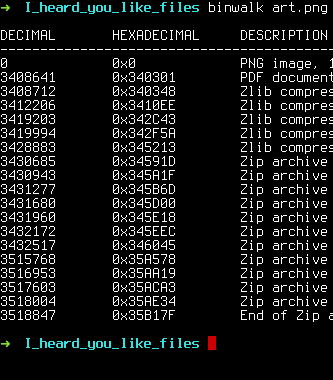

# TAMUctf 19

*sam, 23 fév. 2019, 00:00 GMT — lun, 04 mars 2019, 00:00 GMT*

Team rating points : **3,143**

## Pwn4 (100)

Quand on se connecte au defi, un prompt nous demande les arguments pour la 
commande ls.

Comme il n'y a aucun filtre j'utilise : 


```bash
ls -la | cat flag.txt
```

ce qui donne le flag :

gigem{5y573m_0v3rfl0w}


## HowDyApp (376)

C'est juste un apk

### SmartPhone side

L'application est juste un cliker, quand on clique sur l'icone le chiffre augmente

### apktool side

Grace à apktool on peut "dePacketer" le .apk afin d'observer tous les xml
les .java reste compilé donc quasi illisible

**On peut observer dans les resources du jeux le flag présent dans "/res/values/strings.xml"**
Il est encode en base 64 donc il suffit de le decoder

Ce qui nous donne **gigem{infinite_gigems}**


## cheesy (100)

Quand on telecharge le fichier et que nous l'executons un prompt affiche des
codes en base64 et demande si on peut le trouver le flag.

Il suffit de faire :

```bash
echo "[base64-code]" | base64 -d
```

On trouve vite le flag :

gem{3a5y_R3v3r51N6!}


## Snake Over Cheese (100)

Le fichier fournis est une fichier python 2.7 : 

```bash
$ file reversing2.pyc
```
Strings ne donne rien de particulier, il faut donc le décompiler

### Uncompyle 2

Un voit que le script demmande une chaine de charactere et si elle est egale
a celle rentre, le flag apparait.

Il suffit de rentrer le tableau de valeur et faire ce que fait le prog
On trouve le message secret "SuperSecretKey"

```python
XidT = [83,117,112,101,114,83,101,99,114,101,116,75,101,121]
for i in XidT:
    ku += chr(i)
print XidT
```
On rentre le code dans le prog et le flag apparait
**flag{decompile}**


## -.- (100)

Le fichier flag.txt contient plein de "di" "dit" et "dah"

### Du morse

Appres quelques recherches c'est du morse

en fait : 

* "di" et "dit" => "."
* "dah"		=> "-"

Plus qu'a traduire le tout

### Script python

```Python
fichier = open("flag.txt", "r")
data = fichier.read()
fichier.close()
data = data.replace("-","")
data = data.replace("dit",".")
data = data.replace("di",".")
data = data.replace("dah","-")

retour = open("retour.txt", "w")
retour.write(data)
retour.close()

print "done"
```

Voila on obtient "retour.txt" qui contient la traduction en morse traditionel

### Du morse au texte

Grace a [ce site](http://www.unit-conversion.info/texttools/morse-code/) j'ai
pu traduire du morse en texte

### Putain c'est de l'hexa

En fait apres 1h de recherche j'ai enfin compris que c'est de l'hexadecimal.
Il faut le traduire et hop le flag

gigem{C1icK_cl1CK-y0u_h4v3_m4I1}


## Not Another SQLi Challenge (100)

C'est juste un injection sql simple :

```
' OR 1=1#
```

Ce qui donne le flag :

gem{f4rm3r5_f4rm3r5_w3'r3_4ll_r16h7}


## Robots Rule (100)

Le site parle de robots

Rien dans le source code.

Bien entendu comme le titre l'indique il y a un fichier robots.txt :

www.url.com/robots.txt

On peut y lire :

```
User-agent: *

WHAT IS UP, MY FELLOW HUMAN!
HAVE YOU RECEIVED SECRET INFORMATION ON THE DASTARDLY GOOGLE ROBOTS?!
YOU CAN TELL ME, A FELLOW NOT-A-ROBOT!
```
### User Agent

Le fichier robots.txt nous indique clairement qu'il faut modifier le userAgent
du navigateur

On le fait grace a l'extension firefox **user-agent switcher**

On se transforme en *bot google* et hop le fichier robots.txt change : 

```
User-agent: *

THE HUMANS SUSPECT NOTHING!
HERE IS THE SECRET INFORMATION: gigem{be3p-bOop_rob0tz_4-lyfe}
LONG LIVE THE GOOGLEBOTS!
```


## I heard you like files (306)

Le seul fichier est une image.png

### strings sur le ficher

Rien... une chaine est meme presente nous disant que le flag n'est pas ici

### transformation en pdf

Rien... Une chaine nous envoie balader est nous dis que c'est une fausse piste

### Binwalk

#### Niveau 1

Quand on fait un binwalk on voit que plusieurs fichiers sont encodés apres le
"end of file" du png : 



On extrait tous les fichier avec

```bash
$ binwalk -e firmware.bin
```
#### Niveau 2 

Un fois extrait on observe plein de fichiers. La plupart sont inutiles.
Seulement le fichier word contien un fichier word/media/ qui contient une
image

Quand on fait un binwalk sur le fichier, encore une fois, plusieur fichier sont
encodes.


Un fichier retient particulierement mon attention "0x1636 JPEG image data"

Pour l'extraire il faut utiliser :

```bash
$ binwalk -D 'jpeg image:jpeg' image1png
```
#### Niveau 3

On a maintenant 1636.jpeg

Etant donnee que le type du fichier etudie a change je recomence la procedure
standard (*file, cat, strings, binwalk*)

Avec **strings** on constate une chaine en base64 apres le "%%EOF"

j'essaye de le decoder :

```bash
echo "ZmxhZ3tQMGxZdEByX0QwX3kwdV9HM3RfSXRfTjB3P30K" | base64 -d
```

**BOOM** le flag :

flag{P0lYt@r_D0_y0u_G3t_It_N0w?}
